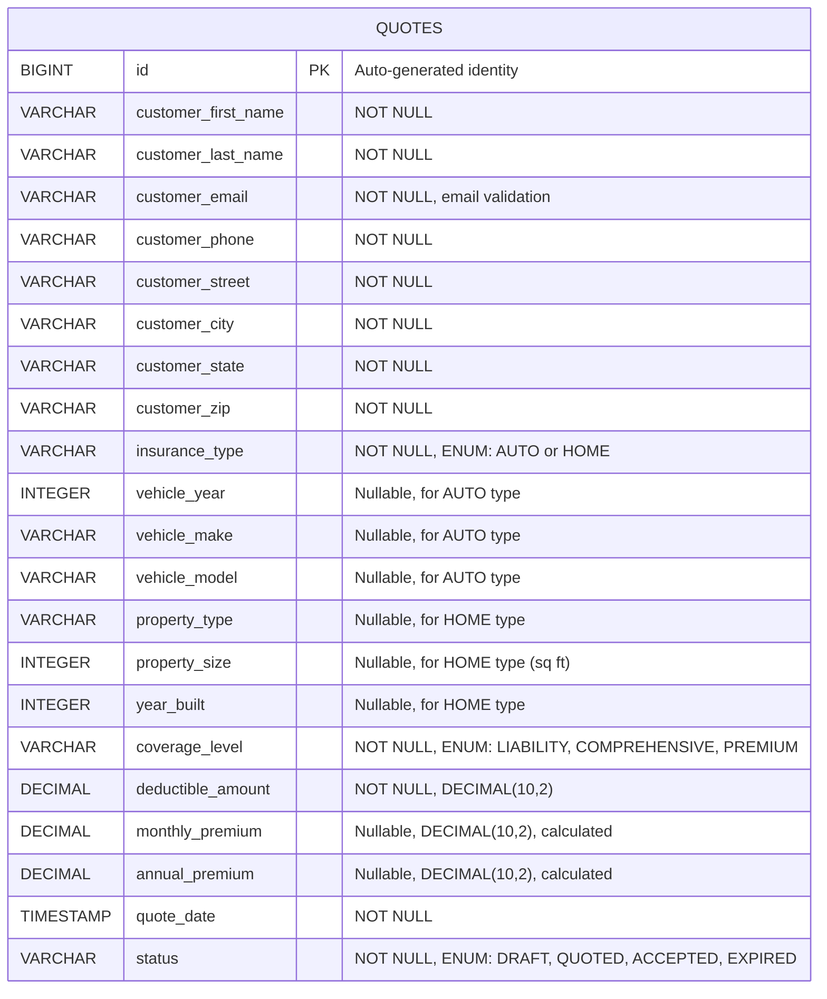

# Three Rivers Insurance Quote Website

A full-stack web application for generating insurance quotes, built with React and Spring Boot, deployed on Azure.

## Tech Stack

| Layer          | Technology                              |
| -------------- | --------------------------------------- |
| Frontend       | React 19, Vite 7, ESLint, Prettier     |
| Backend        | Spring Boot 3.4.1, Java 17, Maven      |
| Database       | PostgreSQL (H2 for tests and local dev)|
| Infrastructure | Terraform, Azure App Service            |
| CI/CD          | GitHub Actions                          |

## Prerequisites

- **Node.js** 20+ and npm
- **Java** 17+ (JDK)
- **Maven** 3.9+
- **PostgreSQL** 15+ (optional — only required if not using the `local` profile)
- **Terraform** 1.5+ (for infrastructure changes only)

## Project Structure

```
├── frontend/          # React 19 + Vite 7 application
├── backend/           # Spring Boot 3.4.1 REST API (Java 17, Maven)
├── infra/             # Terraform infrastructure (Azure)
└── .github/workflows/ # CI/CD pipelines
```

## Backend Architecture

The backend is organized using a layered architecture:

**Package:** `com.threeriverinsurance`

- **`controller/`** — REST API endpoints
  - `QuoteController` — Quote CRUD operations
  - `HealthController` — Health check endpoint
- **`service/`** — Business logic
  - `QuoteService` — Quote management operations
  - `QuoteCalculationService` — Premium calculation engine
- **`model/`** — Data models and DTOs
  - `Quote` — JPA entity (database model)
  - `QuoteRequest` — DTO for creating quotes
  - `QuoteResponse` — DTO for API responses
  - `QuoteMapper` — Entity ↔ DTO mapping
  - `InsuranceType` — Enum (AUTO, HOME)
  - `CoverageLevel` — Enum (LIABILITY, COMPREHENSIVE, PREMIUM)
  - `QuoteStatus` — Enum (DRAFT, QUOTED, ACCEPTED, EXPIRED)
  - `ErrorResponse` — Error response DTO
- **`repository/`** — Data access
  - `QuoteRepository` — Spring Data JPA repository
- **`config/`** — Application configuration
  - `SecurityConfig` — Security settings (CSRF disabled, CORS, security headers)
  - `WebConfig` — Web configuration
  - `GlobalExceptionHandler` — Centralized exception handling
- **`exception/`** — Custom exceptions
  - `QuoteNotFoundException` — Thrown when quote not found

## Database Schema

### ERD Diagram



### Enums

**InsuranceType:**
- `AUTO` — Automobile insurance
- `HOME` — Homeowners insurance

**CoverageLevel:**
- `LIABILITY` — Basic liability coverage (1.0x base rate)
- `COMPREHENSIVE` — Comprehensive coverage (1.5x base rate)
- `PREMIUM` — Premium coverage (2.0x base rate)

**QuoteStatus:**
- `DRAFT` — Quote is being created
- `QUOTED` — Quote has been calculated and provided to customer
- `ACCEPTED` — Customer has accepted the quote
- `EXPIRED` — Quote has expired

### Spring Profiles

The application supports multiple profiles for different environments:

| Profile   | Database   | Description                                     |
|-----------|------------|-------------------------------------------------|
| `local`   | H2         | **Default.** Local development with in-memory database — no external DB needed |
| `default` | PostgreSQL | Production/staging profile (requires DB_URL, DB_USERNAME, DB_PASSWORD env vars) |
| `test`    | H2         | Test profile used by the test suite            |

> **Note:** When no `SPRING_PROFILES_ACTIVE` environment variable is set, the `local` profile is used automatically. Production and staging environments must explicitly set `SPRING_PROFILES_ACTIVE=default` to use PostgreSQL.

## API Reference

### Base URL
```
http://localhost:8080/api
```

### Endpoints

#### 1. Create Quote

**POST** `/api/quotes`

Creates a new insurance quote.

**Request Body:**
```json
{
  "customerFirstName": "John",
  "customerLastName": "Doe",
  "customerEmail": "john.doe@example.com",
  "customerPhone": "(555) 123-4567",
  "customerStreet": "123 Main St",
  "customerCity": "Springfield",
  "customerState": "IL",
  "customerZip": "62701",
  "insuranceType": "AUTO",
  "vehicleYear": 2020,
  "vehicleMake": "Toyota",
  "vehicleModel": "Camry",
  "propertyType": null,
  "propertySize": null,
  "yearBuilt": null,
  "coverageLevel": "COMPREHENSIVE",
  "deductibleAmount": 1000.00,
  "deductibleAmount": 1000.00
}
```

**Response:** `201 Created`
```json
{
  "id": 1,
  "customerFirstName": "John",
  "customerLastName": "Doe",
  "customerEmail": "john.doe@example.com",
  "customerPhone": "(555) 123-4567",
  "customerStreet": "123 Main St",
  "customerCity": "Springfield",
  "customerState": "IL",
  "customerZip": "62701",
  "insuranceType": "AUTO",
  "vehicleYear": 2020,
  "vehicleMake": "Toyota",
  "vehicleModel": "Camry",
  "propertyType": null,
  "propertySize": null,
  "yearBuilt": null,
  "coverageLevel": "COMPREHENSIVE",
  "deductibleAmount": 1000.00,
  "monthlyPremium": 171.00,
  "annualPremium": 1949.40,
  "quoteDate": "2024-01-15T10:30:00",
  "status": "QUOTED"
}
```

#### 2. Get Quote by ID

**GET** `/api/quotes/{id}`

Retrieves a specific quote by ID.

**Response:** `200 OK`
```json
{
  "id": 1,
  "customerFirstName": "John",
  "customerLastName": "Doe",
  "customerEmail": "john.doe@example.com",
  "customerPhone": "(555) 123-4567",
  "customerStreet": "123 Main St",
  "customerCity": "Springfield",
  "customerState": "IL",
  "customerZip": "62701",
  "insuranceType": "AUTO",
  "vehicleYear": 2020,
  "vehicleMake": "Toyota",
  "vehicleModel": "Camry",
  "propertyType": null,
  "propertySize": null,
  "yearBuilt": null,
  "coverageLevel": "COMPREHENSIVE",
  "deductibleAmount": 1000.00,
  "monthlyPremium": 171.00,
  "annualPremium": 1949.40,
  "quoteDate": "2024-01-15T10:30:00",
  "status": "QUOTED"
}
```

**Error Response:** `404 Not Found`
```json
{
  "message": "Quote not found with id: 999"
}
```

#### 3. List All Quotes

**GET** `/api/quotes`

Retrieves all quotes with optional filtering.

**Query Parameters:**
- `status` (optional) — Filter by status (DRAFT, QUOTED, ACCEPTED, EXPIRED)
- `insuranceType` (optional) — Filter by insurance type (AUTO, HOME)

**Examples:**
```
GET /api/quotes
GET /api/quotes?status=QUOTED
GET /api/quotes?insuranceType=AUTO
GET /api/quotes?status=QUOTED&insuranceType=AUTO
```

**Response:** `200 OK`
```json
[
  {
    "id": 1,
    "customerFirstName": "John",
    "customerLastName": "Doe",
    "insuranceType": "AUTO",
    "coverageLevel": "COMPREHENSIVE",
    "monthlyPremium": 171.00,
    "annualPremium": 1949.40,
    "status": "QUOTED"
  },
  {
    "id": 2,
    "customerFirstName": "Jane",
    "customerLastName": "Smith",
    "insuranceType": "HOME",
    "coverageLevel": "PREMIUM",
    "monthlyPremium": 325.50,
    "annualPremium": 3709.80,
    "status": "ACCEPTED"
  }
]
```

#### 4. Update Quote

**PUT** `/api/quotes/{id}`

Updates an existing quote.

**Request Body:** Same as Create Quote

**Response:** `200 OK`
Returns the updated quote object (same format as Get Quote).

**Error Response:** `404 Not Found` if quote doesn't exist

#### 5. Delete Quote

**DELETE** `/api/quotes/{id}`

Deletes a quote by ID.

**Response:** `204 No Content`

**Error Response:** `404 Not Found` if quote doesn't exist

#### 6. Health Check

**GET** `/api/health`

Returns application health status.

**Response:** `200 OK`
```json
{
  "status": "UP"
}
```

### Swagger UI

Interactive API documentation is available at:
```
http://localhost:8080/swagger-ui.html
```

## Premium Calculation Logic

The `QuoteCalculationService` calculates insurance premiums using the following algorithm:

### Base Rates

| Insurance Type | Base Rate (Monthly) |
|----------------|---------------------|
| AUTO           | $100.00             |
| HOME           | $150.00             |

### Coverage Level Multipliers

| Coverage Level | Multiplier |
|----------------|-----------|
| LIABILITY      | 1.0x      |
| COMPREHENSIVE  | 1.5x      |
| PREMIUM        | 2.0x      |

### Deductible Discounts

| Deductible Amount | Discount |
|-------------------|----------|
| < $1,000          | 0%       |
| $1,000 - $2,499   | 5%       |
| $2,500 - $4,999   | 10%      |
| $5,000+           | 15%      |

### Auto Insurance: Vehicle Age Factor

| Vehicle Age      | Premium Adjustment |
|------------------|-------------------|
| 0-3 years (new)  | +20%              |
| 4-7 years        | +10%              |
| 8+ years (older) | 0%                |

### Home Insurance: Property Size Factor

For properties over 1,000 sq ft:
```
Additional charge = (property_size - 1000) / 100 × $0.05 per month
```

Example: 2,500 sq ft home = (2500 - 1000) / 100 × $0.05 = $0.75/month

### Annual Premium Calculation

Annual premiums receive a **5% discount** compared to paying monthly:

```
Annual Premium = Monthly Premium × 12 × 0.95
```

### Calculation Examples

**Example 1: Auto Insurance**
- Base Rate: $100
- Coverage: COMPREHENSIVE (1.5x) = $150
- Vehicle: 2020 (4 years old) = +10% = $165
- Deductible: $1,000 = -5% = $156.75/month
- Annual: $156.75 × 12 × 0.95 = $1,786.95

**Example 2: Home Insurance**
- Base Rate: $150
- Coverage: PREMIUM (2.0x) = $300
- Property Size: 2,500 sq ft = +$0.75 = $300.75
- Deductible: $2,500 = -10% = $270.68/month
- Annual: $270.68 × 12 × 0.95 = $3,085.74

## Security

The application implements the following security measures:

- **Spring Security** configured with CSRF disabled (stateless REST API)
- **Security Headers:**
  - `X-Frame-Options: SAMEORIGIN` — Prevents clickjacking while allowing H2 console frames
  - `Content-Security-Policy` — Restricts resource loading
  - `Strict-Transport-Security` (HSTS) — Enforces HTTPS
- **CORS Configuration** — Allows requests from `http://localhost:5173` (frontend dev server)
- **Input Validation** — Email format validation, required field checks
- **Exception Handling** — Centralized error handling with consistent error responses

## Code Quality

The project enforces code quality through automated tooling:

| Tool       | Purpose                        | Configuration              |
|------------|--------------------------------|----------------------------|
| Checkstyle | Java code style enforcement    | `checkstyle.xml` (Google-based rules) |
| SpotBugs   | Static bug detection           | `spotbugs-exclude.xml` (max effort, medium threshold) |
| JaCoCo     | Code coverage reporting        | Integrated with Maven      |
| ESLint     | JavaScript/React linting       | Frontend configuration     |
| Prettier   | Code formatting                | Frontend configuration     |

## Local Development

### Frontend

```bash
cd frontend
npm install
npm run dev
```

The dev server starts at **http://localhost:5173** with hot reload.

Available scripts:

| Script           | Description                     |
| ---------------- | ------------------------------- |
| `npm run dev`    | Start dev server                |
| `npm run build`  | Production build to `dist/`     |
| `npm run lint`   | Run ESLint                      |
| `npm run lint:fix`| Auto-fix lint issues           |
| `npm run format` | Format code with Prettier       |
| `npm run preview`| Preview production build        |

### Frontend Architecture

The frontend is built with React 19 and features:

- **Multi-step Quote Wizard:**
  1. Customer Information — Name, contact, address
  2. Property/Vehicle Details — Type-specific fields
  3. Coverage Selection — Coverage level and deductible
  4. Quote Review — Final review and submission

- **Styling:** Custom CSS with brand color `#1a5276` (Three Rivers blue)
- **Build Tool:** Vite 7 for fast development and optimized builds
- **Code Quality:** ESLint + Prettier for consistent code style

### Backend

The backend defaults to H2 in-memory database for zero-setup local development:

#### Quick Start (H2 In-Memory Database) — **DEFAULT**

No database setup required! The `local` profile (H2) is now the default:

```bash
cd backend
mvn spring-boot:run
```

The API starts at **http://localhost:8080** with an H2 in-memory database.

**H2 Console Access:**
- URL: `http://localhost:8080/h2-console`
- JDBC URL: `jdbc:h2:mem:insurance_quote`
- Username: `sa`
- Password: *(leave empty)*

**Note:** All data is stored in memory and will be lost when the application stops. Perfect for development and testing!

#### PostgreSQL Setup (Optional)

For production-like local development with persistent data:

1. **Set up PostgreSQL** — create a database named `insurance_quote`:

   ```bash
   createdb insurance_quote
   ```

2. **Set environment variables:**

   ```bash
   export DB_USERNAME=your_db_user
   export DB_PASSWORD=your_db_password
   export SPRING_PROFILES_ACTIVE=default
   # Optional: override DB URL (default: jdbc:postgresql://localhost:5432/insurance_quote)
   # export DB_URL=jdbc:postgresql://localhost:5432/insurance_quote
   ```

3. **Run the application:**

   ```bash
   cd backend
   mvn spring-boot:run
   ```

   Or specify the profile explicitly:

   ```bash
   cd backend
   mvn spring-boot:run -Dspring-boot.run.profiles=default
   ```

The API starts at **http://localhost:8080**. Health check: `GET /api/health`

### Available Maven Commands

| Command              | Description                                    |
| -------------------- | ---------------------------------------------- |
| `mvn spring-boot:run`| Start with H2 in-memory database (default)     |
| `mvn spring-boot:run -Dspring-boot.run.profiles=default` | Start with PostgreSQL |
| `mvn clean verify`   | Build, test, checkstyle, and SpotBugs analysis |
| `mvn test`           | Run tests only (uses H2 in-memory database)    |

## Testing

### Backend Tests

The backend includes comprehensive unit and integration tests:

**Test Suites:**
- `QuoteControllerTest` — REST API endpoint tests
- `QuoteServiceTest` — Business logic tests
- `QuoteCalculationServiceTest` — Premium calculation tests
- `QuoteIntegrationTest` — End-to-end integration tests
- `SecurityIntegrationTest` — Security configuration tests
- `ApplicationTests` — Application context loading tests

**Test Utilities:**
- `TestDataFactory` — Provides test data builders for quotes

Run tests using Maven:

```bash
cd backend
mvn clean verify         # Build, test, and run code quality checks
mvn test                 # Run tests only with H2 in-memory database
```

JaCoCo coverage reports are generated in `backend/target/site/jacoco/`.

### Frontend Tests

Run tests locally using Vitest:

```bash
cd frontend
npm test                  # Run tests once
npm run test:watch       # Run tests in watch mode
npm run test:coverage    # Run tests with coverage report
```

Coverage reports are generated in `frontend/coverage/`.

### Infrastructure Validation

```bash
cd infra
terraform init
terraform plan -var-file=environments/dev.tfvars
```

See `infra/variables.tf` for available configuration options.

## CI/CD

GitHub Actions workflows run automatically on pull requests and pushes:

### Continuous Integration

- **Frontend CI** (`frontend-ci.yml`)
  - Triggered by changes in `frontend/` directory
  - Node.js 20 environment
  - Runs: `npm ci`, `npm run lint`, `npm run build`
  
- **Backend CI** (`backend-ci.yml`)
  - Triggered by changes in `backend/` directory
  - Java 17 environment
  - Runs: `mvn clean verify` (compile, test, Checkstyle, SpotBugs)

### Continuous Deployment

- **Deploy Frontend** (`deploy-frontend.yml`)
  - Triggered on push to `main` branch (frontend changes)
  - Deploys to Azure Static Web App
  - Automatic build and deployment
  
- **Deploy Backend** (`deploy-backend.yml`)
  - Triggered on push to `main` branch (backend changes)
  - Deploys to Azure App Service
  - Includes database migration steps

- **Infrastructure** (Terraform)
  - Azure Storage for remote state management
  - Automated provisioning via Terraform workflows

## Deployment

The application is deployed to Microsoft Azure using GitHub Actions for continuous deployment:

- **Frontend** — Azure Static Web App (deployed on push to `main`)
- **Backend** — Azure App Service with Java 17 runtime (deployed on push to `main`)
- **Database** — Azure Database for PostgreSQL Flexible Server
- **Infrastructure** — Managed with Terraform

### Architecture Overview

```
┌─────────────────┐
│   GitHub        │
│   Actions       │──────┐
└─────────────────┘      │
                         │ Deploy
                         ▼
          ┌──────────────────────────┐
          │      Azure Cloud         │
          │                          │
          │  ┌────────────────────┐  │
          │  │  Static Web App    │  │
          │  │  (React Frontend)  │  │
          │  └─────────┬──────────┘  │
          │            │              │
          │            │ HTTPS        │
          │            │              │
          │  ┌─────────▼──────────┐  │
          │  │   App Service      │  │
          │  │  (Spring Boot API) │  │
          │  └─────────┬──────────┘  │
          │            │              │
          │            │ JDBC         │
          │            │              │
          │  ┌─────────▼──────────┐  │
          │  │   PostgreSQL DB    │  │
          │  │  (Flexible Server) │  │
          │  └────────────────────┘  │
          └──────────────────────────┘
```

### Required GitHub Secrets

Configure these secrets in your repository settings (Settings → Secrets and variables → Actions):

| Secret                              | Description                                                                 |
| ----------------------------------- | --------------------------------------------------------------------------- |
| `AZURE_CREDENTIALS`                 | Azure service principal JSON for authentication (format: `{"clientId": "...", "clientSecret": "...", "subscriptionId": "...", "tenantId": "..."}`) |
| `AZURE_STATIC_WEB_APPS_API_TOKEN`   | Deployment token for Azure Static Web App (found in Azure Portal)          |
| `AZURE_APP_NAME`                    | Name of the Azure App Service instance (e.g., `threerivers-insurance-api`) |
| `TF_VAR_db_admin_username`          | PostgreSQL database admin username (for Terraform provisioning)            |
| `TF_VAR_db_admin_password`          | PostgreSQL database admin password (for Terraform provisioning)            |

### Manual Deployment

Deployments can be triggered manually via the GitHub Actions UI using the `workflow_dispatch` event on the respective workflow.

## Environment Variables

### Backend Environment Variables

The backend application requires the following environment variables based on the active profile:

#### Default Profile (PostgreSQL — Production/Staging)

These variables are required when running with `SPRING_PROFILES_ACTIVE=default`:

| Variable       | Description                          | Example                                      |
|----------------|--------------------------------------|----------------------------------------------|
| `DB_URL`       | PostgreSQL JDBC connection string    | `jdbc:postgresql://localhost:5432/insurance_quote` |
| `DB_USERNAME`  | Database username                    | `postgres`                                   |
| `DB_PASSWORD`  | Database password                    | `your_secure_password`                       |

#### Local Profile (H2)

No environment variables required! The H2 database is configured automatically.

## Project Features

### Implemented Features

✅ Full CRUD operations for insurance quotes  
✅ Support for both Auto and Home insurance types  
✅ Dynamic premium calculation engine  
✅ Multi-step quote wizard UI  
✅ RESTful API with comprehensive validation  
✅ Database persistence with JPA/Hibernate  
✅ Automated testing (unit + integration)  
✅ Code quality enforcement (Checkstyle, SpotBugs, ESLint)  
✅ CI/CD pipelines with GitHub Actions  
✅ Azure cloud deployment  
✅ H2 in-memory database for local development  
✅ API documentation with Swagger UI  
✅ Security headers and CORS configuration  

### Potential Enhancements

- [ ] User authentication and authorization
- [ ] Payment processing integration
- [ ] Document generation (PDF quotes)
- [ ] Email notifications
- [ ] Quote comparison feature
- [ ] Admin dashboard
- [ ] Analytics and reporting

## Contributing

1. Fork the repository
2. Create a feature branch (`git checkout -b feature/amazing-feature`)
3. Make your changes
4. Run tests and code quality checks:
   ```bash
   # Backend
   cd backend
   mvn clean verify
   
   # Frontend
   cd frontend
   npm run lint
   npm test
   ```
5. Commit your changes (`git commit -m 'Add amazing feature'`)
6. Push to the branch (`git push origin feature/amazing-feature`)
7. Open a Pull Request

## License

This project is for demonstration purposes.


